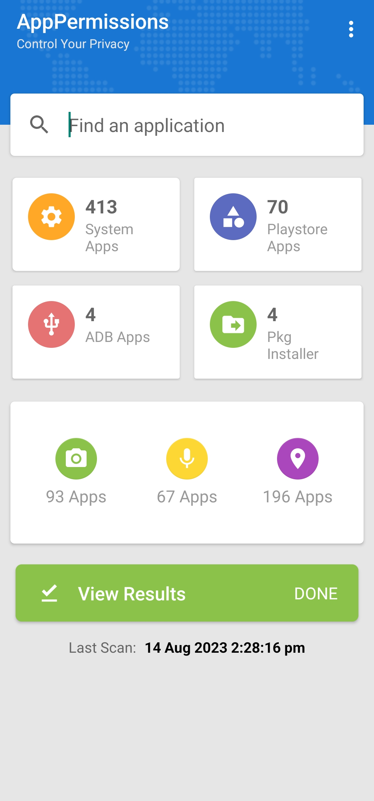

# AppPermissions
The project "AppPermissions: Control Your Privacy" aims at developing an Android application that helps users to take control of their privacy. The app provides a list of system and third-party applications installed on the user's device, along with details about the permissions requested by each app. Users can easily identify and manage dangerous permissions granted to apps. Furthermore, the app implements segregation based on permission types, such as camera, location, and microphone, offering a simple way to understand and manage the permissions effectively.

The app offers a set of following features:

### Feature 1: Comprehensive App List
The application provides users with a list of both system and third-party applications installed on their devices.

### Feature 2: Detailed App Permissions
The app displays all the dangerous permissions requested by an app, including sensitive ones like camera, location data, and microphone. 

### Feature 3: Permission Status
The app indicates whether dangerous permissions have been granted by the user. 

### Feature 4: Segregation by Permission Type
To make permission management easier, the app segregates apps based on their permission types. Users can quickly identify which apps have access to specific functionalities, such as camera, location, or microphone. 

#### Screenshots
| Splash Screen                       | Home Screen                         | Results Screen                              |
| ----------------------------------- | ----------------------------------- | ------------------------------------------- |
|  |  |  |

